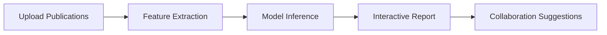

# Star Scientist Prediction Platform User Guide

## Getting Started
1. **Registration**
   - Create account using institutional email
   - Complete profile with research background
2. **Dashboard Overview**
   - Real-time prediction scores
   - Career progression visualization
   - Collaboration recommendations

## Key Features
### For Researchers
- **Profile Analysis**: Upload publication history, grants, and collaborations
- **Potential Score**: Interactive visualization of prediction components
- **Network Builder**: Connect with suggested collaborators

### For Funding Agencies
- **Talent Discovery**: Filter researchers by:
  - Prediction confidence intervals
  - Research specialization areas
  - Institutional collaboration networks
- **Portfolio Analytics**: Track funded researchers' trajectory

### For Administrators
- **Model Monitoring**:
  - Performance metrics dashboard
  - Feature drift detection alerts
- **User Management**:
  - Role-based access control
  - Audit logs

## Prediction Interface

